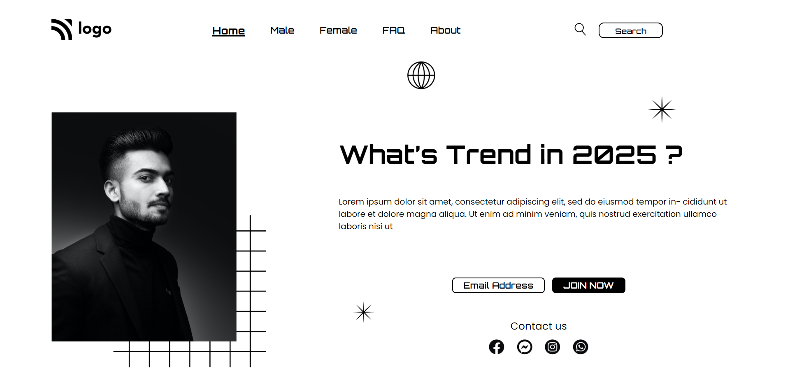

# Assignment 1

## Project 1 [Live Link](https://street-style-og.netlify.app)

-   Skills Gained in this project
    -   Learned to positioning the elements.
    -   Learned the different ways of targeting the elements.

---

## Time taken to finish this project

-   Approximately 6-7 hour taken to complete this one.

#### Screenshot

